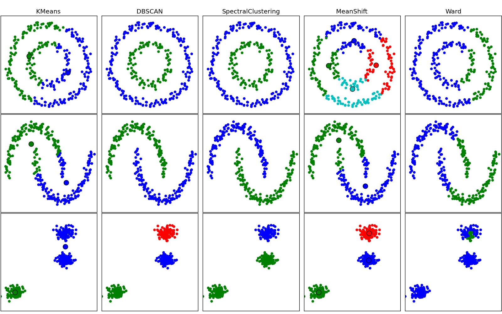
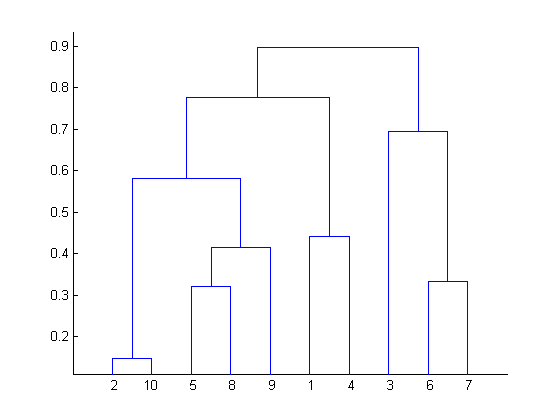

---
title: Clustering
author: Javier G. Sogo
date: 10 de marzo de 2015 
subtitle: Clasificación no supervisada
---

# Introducción

## Objetivos
Conjunto de casos u objetos, cada uno de ellos caracterizado por varias variables:

|       | $Var_1$ | $\dots$ | $Var_i$ | $\dots$ | $Var_n$ |
|-------|---------|---------|---------|---------|---------|
| $x_1$ | $x_1^1$ | $\dots$ | $x_i^1$ | $\dots$ | $x_n^1$ |
| $x_1$ | $\dots$ | $\dots$ | $\dots$ | $\dots$ | $\dots$ |
| $x_j$ | $x_1^j$ | $\dots$ | $x_i^j$ | $\dots$ | $x_n^j$ |
| $x_1$ | $\dots$ | $\dots$ | $\dots$ | $\dots$ | $\dots$ |
| $x_N$ | $x_1^N$ | $\dots$ | $x_i^N$ | $\dots$ | $x_n^N$ |

 * Encontrar _conglomerados_/grupos/clusters que emerjan naturalmente de los datos.
 * Los elementos de un grupo son _similares_ y pueden ser descritos por características comunes.
 * _Homogeneidad_ dentro de un grupo y _heterogeneidad_ entre grupos.
 * Puede ser considerado un _arte_.

## Ejemplos
 * _Marketing_: segmentación de clientes o usuarios: publicidad, sistemas de recomendación,...
 * _Textos_: clasificación de documentos en temáticas.
 * _Internet_: grupos de usuarios con patrones de comportamiento similares.

## Tipos de clustering
 * _Jerárquico_: los datos se van agrupando en conjuntos cada vez más numerosos hasta que sólo queda
   uno de ellos que reune a todos los elementos.
 * No jerárquico:
   * _Particional_: los elementos se dividen en un número determinado de grupos (prefijado de antemano)
   * _Probabilista_: un elemento puede pertenecer a varios grupos simultáneamente con distintas probabilidades. 

## Interpretación geométrica

Comparación visual de algunos algoritmos de clustering (http://jaquesgrobler.github.io/Online-Scikit-Learn-stat-tut/modules/clustering.html)

 * En general cada observación será un punto en $R^n$
 * Visualmente resulta poco claro para $n>2$
 * Se considera una herramienta _exploratoria_ para generar hipótesis (no las contrasta).

## Pasos

 #. Seleccionar una medida de _distancia_/similaridad adecuada.
 #. Elegir la _técnica_ de clustering: jerárquico, no jerárquico.
 #. Elegir el _método/algoritmo_ dentro de la técnica.
 #. (Decidir el número de clusters)
 #. _Interpretar_ los resultados (en base a qué atributos se ha generado la división)

# Clustering jerárquico

## Tipos de clustering jerárquico

### Ascendente o aglomerativo
 * Paso 1: _N_ clusters (cada elementos es un cluster).
 * Paso 2: _N - 1_ clusters (se unen los dos elementos más próximos).
 
$\vdots$

 * Paso N: 1 cluster con todos los puntos.

### Descendente o divisivo
Es el proceso inverso al *clustering jerárquico ascendente*.

## Distancia entre un elemento y un cluster
El cálculo de la distancia entre un punto y un cluster puede realizarse de diferentes formas:

 * Enlace simple o vecino más próximo: mínima distancia entre todos los posibles pares de objectos en ambos clusters:
 
   $D(C, C') = min_{x \in C, x' \in C'} d(\mathbf{x},\mathbf{x'})$
  
 * Enlace completo o vecino más lejano: máxima distancia entre todos los posibles pares.
 
   $D(C, C') = max_{x \in C, x' \in C'} d(\mathbf{x},\mathbf{x'})$

 * Enlace medio: media de las distancias de todos los pares.

   $D(C, C') = \frac{1}{|C||C'|} \sum_{x \in C, x' \in C'} d(\mathbf{x}, \mathbf{x'})$

## Distancia entre un elemento y un cluster
 * Centroide: reemplazar cada cluster por su centroide (unitario) y calcular la distancia entre centroides.
 
   $c^j = \frac{1}{|C|} \sum_{x \in C} x, r = 1,\dots,n$

   $D(C, C') = d(c^j, c'^j)$

 * Ward: se calcula la suma total de desviaciones de la media de un cluster y trata de minimizarla. _No es una medida de distancia_.

## Dendograma o árbol jerárquico
 * 2, 10, 5, 8, 9, 1, 4, 3, 6, 7
 * (2, 10), 5, 8, 9, 1, 4, 3, 6, 7
 * (2, 10), (5, 8), 9, 1, 4, 3, 6, 7
 * (2, 10), (5, 8), 9, 1, 4, 3, (6, 7)
 * (2, 10), (5, 8, 9), 1, 4, 3, (6, 7)
 * (2, 10), (5, 8, 9), (1, 4), 3, (6, 7)
 * (2, 10, 5, 8, 9), (1, 4), 3, (6, 7)
 * (2, 10, 5, 8, 9), (1, 4), (3, 6, 7)
 * (2, 10, 5, 8, 9, 1, 4), (3, 6, 7)
 * (2, 10, 5, 8, 9, 1, 4, 3, 6, 7)

¿Dónde cortar? Se puede utilizar un *scree-plot* distancia-nº clusters
